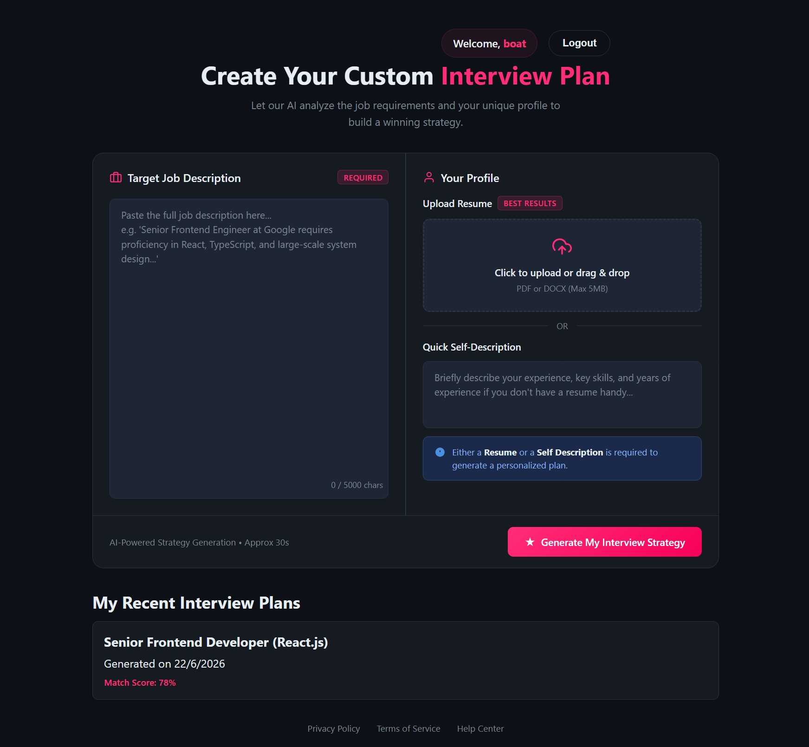
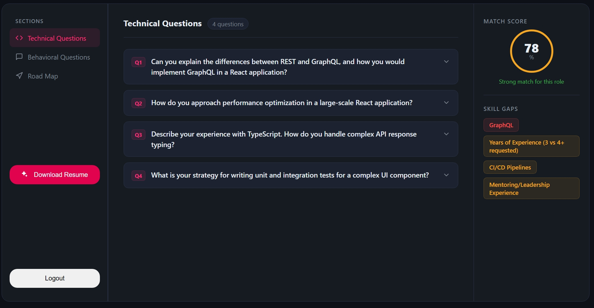

# PrepPilot AI

AI-Powered Interview Preparation & Resume Optimization Platform

PrepPilot AI helps job seekers prepare for interviews by analyzing their resume, self-description, and target job description using Generative AI. The platform generates personalized interview reports, identifies skill gaps, predicts interview questions, provides model answers, and creates a tailored preparation roadmap.

---

## Features

### Authentication & Security
- JWT-based Authentication
- HTTP-only Cookie Sessions
- Protected Routes
- User-specific Reports
- Secure Password Hashing using bcrypt

### AI-Powered Interview Analysis
- Resume Analysis
- Job Description Analysis
- Candidate Profile Analysis
- Match Score Generation (0–100)

### Technical Interview Preparation
- Predicted Technical Questions
- Interviewer's Intent Behind Each Question
- Suggested Answer Frameworks

### Behavioral Interview Preparation
- Predicted Behavioral Questions
- Interviewer's Intent Behind the questions
- Structured Response Guidance

### Skill Gap Analysis
- Missing Skill Detection
- Severity Classification
  - Low
  - Medium
  - High

### Personalized Preparation Roadmap
- Day-wise Preparation Plan
- Focus Areas
- Actionable Tasks

### Resume Optimization
- ATS-Friendly Resume Generation
- Job-Specific Resume Tailoring
- Professional PDF Export

---

## Tech Stack

### Frontend
- React
- Vite
- React Router
- Context API
- Axios
- SCSS

### Backend
- Node.js
- Express.js

### Database
- MongoDB
- Mongoose

### Authentication
- JWT
- Cookie-Based Authentication
- bcryptjs

### AI Layer
- Gemini 3 Flash Preview
- Structured Output Generation
- Zod Schema Validation

### Document Processing
- PDF Parsing
- Puppeteer PDF Generation

---

## System Architecture

```text
User
 │
 ▼
React Frontend
 │
 ▼
Express API
 │
 ├── Authentication Layer
 │      └── JWT + Cookies
 │
 ├── Resume Processing
 │      └── PDF Parser
 │
 ├── Gemini AI Service
 │      └── Interview Analysis
 │
 ├── Resume Generator
 │      └── ATS Resume Creation
 │
 ▼
MongoDB
```

---

## AI Workflow

```text
Resume Upload
       +
Self Description
       +
Job Description
       │
       ▼
Gemini 3 Flash Preview
       │
       ▼
Structured Interview Report
       │
       ├── Match Score
       ├── Technical Questions
       ├── Behavioral Questions
       ├── Skill Gaps
       ├── Preparation Plan
       └── Resume Optimization
```

---

## Interview Report Structure

### Match Score

```json
{
  "matchScore": 86
}
```

### Technical Questions

```json
{
  "question": "...",
  "intention": "...",
  "answer": "..."
}
```

### Behavioral Questions

```json
{
  "question": "...",
  "intention": "...",
  "answer": "..."
}
```

### Skill Gaps

```json
{
  "skill": "System Design",
  "severity": "high"
}
```

### Preparation Plan

```json
{
  "day": 1,
  "focus": "Data Structures",
  "tasks": [
    "Solve Array Problems",
    "Review HashMaps"
  ]
}
```

---

## Project Structure

```text
PrepPilot-AI
│
├── Frontend
│   ├── public
│   ├── src
│   │   ├── features
│   │   │   ├── auth
│   │   │   └── interview
│   │   ├── App.jsx
│   │   ├── app.routes.jsx
│   │   ├── main.jsx
│   │   └── styles
│   └── package.json
│
├── Backend
│   ├── src
│   │   ├── config
│   │   ├── controllers
│   │   ├── middlewares
│   │   ├── models
│   │   ├── routes
│   │   └── services
│   ├── app.js
│   ├── server.js
│   └── package.json
│
└── README.md
```

### Architecture Overview

* **Frontend:** Built with React and Vite using a feature-based architecture. Each feature (`auth`, `interview`) encapsulates its own pages, hooks, services, context, and styles for better scalability and maintainability.
* **Backend:** Built with Express.js following the MVC pattern, separating concerns through controllers, routes, models, services, middlewares, and configuration modules.
* **Authentication:** JWT-based authentication with protected routes and token blacklisting support.
* **AI Integration:** Interview analysis and feedback are handled through a dedicated AI service layer.
* **Database:** MongoDB is used for storing user accounts and interview reports.


---

## Environment Variables

### Backend

```env
PORT=3000

MONGODB_URI=your_mongodb_connection_string

JWT_SECRET=your_jwt_secret

GOOGLE_GENAI_API_KEY=your_google_genai_api_key
```

---

## Installation

### Clone Repository

```bash
git clone https://github.com/16niraj/PrepPilot-AI.git
```

### Backend Setup

```bash
cd Backend

npm install

npm run dev
```

### Frontend Setup

```bash
cd Frontend

npm install

npm run dev
```

---

## API Endpoints

### Authentication

| Method | Endpoint |
|----------|----------|
| POST | /api/auth/register |
| POST | /api/auth/login |
| POST | /api/auth/logout |
| GET | /api/auth/get-me |

### Interview Reports

| Method | Endpoint |
|----------|----------|
| POST | /api/interview |
| GET | /api/interview |
| GET | /api/interview/report/:interviewId |

### Resume Generation

| Method | Endpoint |
|----------|----------|
| POST | /api/interview/resume/pdf/:id |

---

## Screenshots

### Dashboard




### Interview Report Generation page


---

## Future Improvements

- Mock Interview Simulator
- Voice-Based Interview Practice
- Real-Time Feedback
- Company-Specific Interview Preparation
- Multi-Resume Management
- Interview Performance Tracking
- Cover Letter Generation
- LinkedIn Profile Optimization

---

## Deployment

### Frontend
Vercel

### Backend
Render

### Database
MongoDB Atlas

---

## Why I Built This

Preparing for interviews typically requires multiple tools for resume optimization, interview preparation, and skill assessment.

PrepPilot AI combines these workflows into a single platform by leveraging Generative AI to provide personalized, actionable interview preparation guidance.

---

## Author

Niraj Kumar, CSE, IIT Gnadhinagar

Built using React, Express, MongoDB, and Gemini AI.